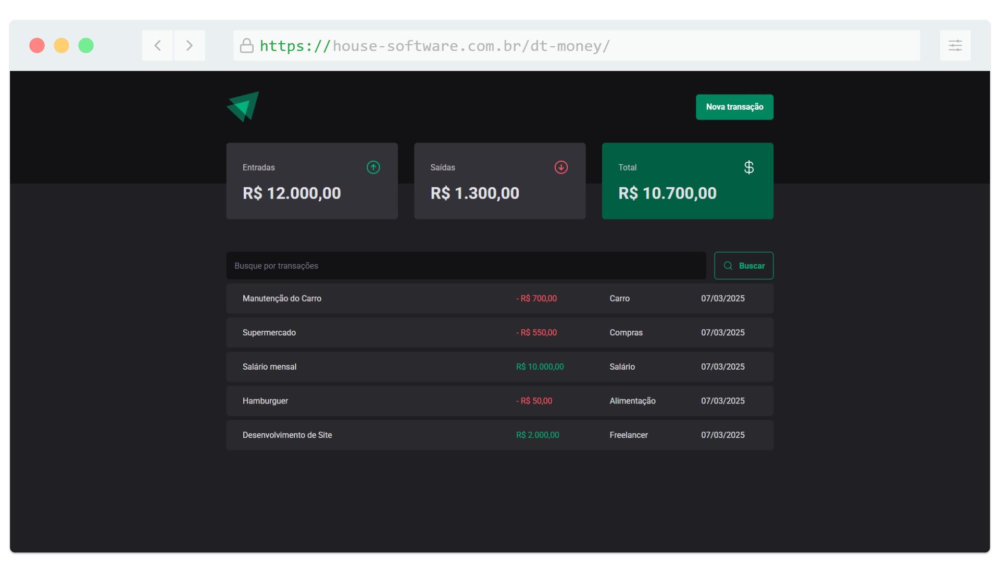
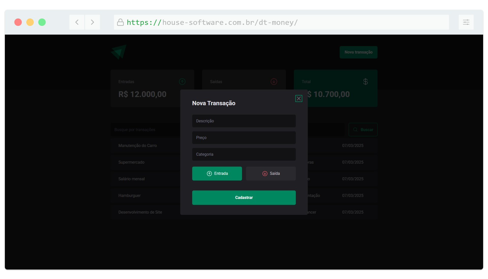
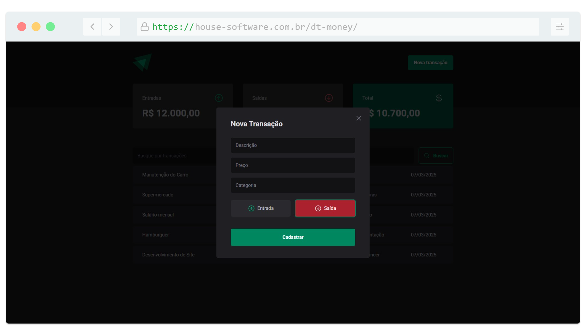

<h1 align="center">
   
</h1>

<h4 align="center"> 
	🚧 DT Money 🚀 Concluido... 🚀
</h4>

## ✅ Funções

- <h3>DT Money</h3>

  - [x] Criar transação
  - [x] Listar transações
  - [x] Pesquisar transações

## 📚 Descrição

🚀 Avançando cada vez mais no React.js!

Dessa vez, criei a aplicação DT Money, um gerenciador de transações financeiras que permite registrar, listar e pesquisar transações de forma intuitiva. Além disso, a aplicação consome uma REST API em Spring Boot com um banco de dados MySQL, garantindo uma experiência robusta e eficiente.

📌 Principais tecnologias e recursos utilizados:
✅ React.js na construção da interface
✅ Axios para comunicação com a API
✅ React Hook Form e Zod para validação de formulários
✅ Styled-components para estilização
✅ Context API com use-context-selector para otimizar o gerenciamento de estado

Estou muito animado com essa jornada e cada vez mais aprofundando meus conhecimentos em React.js e Spring Boot. 🚀

#ReactJS #SpringBoot #DesenvolvimentoWeb #FullStack #DTMoney #APIRest #FrontEnd #BackEnd #JavaScript #TypeScript
## 🛠 Tecnologias

As seguintes ferramentas foram usadas na construção do projeto:
          
- [Vue.js (v5.0.8)](https://vuejs.org/)
- [Node.js (v20.11.0)](https://nodejs.org/en)
- [NPM (v10.2.4)](https://www.npmjs.com/)
- [HTML5](https://www.w3schools.com/html/default.asp)
-  [CSS 3](https://www.w3schools.com/css/)
-  [JavaScript](https://developer.mozilla.org/pt-BR/docs/Web/JavaScript)

## 📱 Plataforma adotada

- Web;

## 📸 Screenshot

	
	

